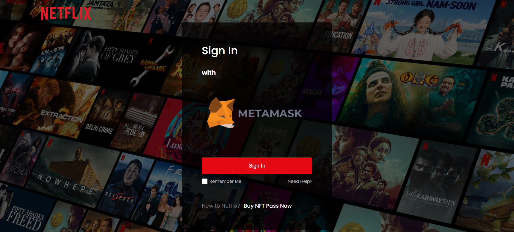
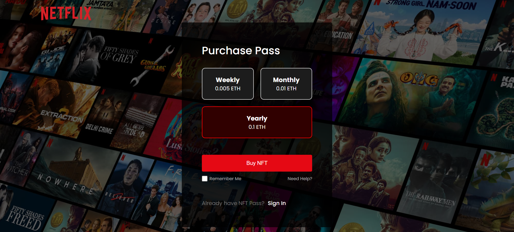

# 🎬 Netflix Clone with Blockchain-Based Subscription (NFT Powered)

A decentralized Netflix-like platform where users can subscribe using NFTs. Built using React (Vite), Ethereum Smart Contracts (Solidity), and MetaMask wallet integration.

> ✅ Deployed and tested on the Sepolia Testnet  
> 🧪 Minted NFTs act as subscription passes for weekly, monthly, or yearly access

---

## 🚀 Features

- **Web3 Login with MetaMask**
- **Time-based Subscription NFTs**
  - Weekly, Monthly, or Yearly
- **ERC-721 Smart Contract**
  - Written in Solidity
- **IPFS-based Metadata Hosting**
- **Frontend built with React + Vite**
  - Clean and responsive UI
  - Netflix-like design with user-friendly flow

---

## 🛠️ Tech Stack

| Layer          | Technology                     |
|----------------|--------------------------------|
| Frontend       | React.js (Vite)                |
| Wallet Support | MetaMask + ethers.js           |
| Blockchain     | Solidity (ERC-721)             |
| Backend        | No backend (fully decentralized) |
| Storage        | IPFS via Pinata                |
| Network        | Ethereum Sepolia Testnet       |

---

## 📸 Screenshots

> 
> 
> 

---

## 🔗 Smart Contract Details

- **Contract Name:** `SubscriptionNFT`
- **Network:** Ethereum Sepolia
- **Functions:**
  - `mintWeekly()`, `mintMonthly()`, `mintYearly()`
  - `isSubscribed(address)`
  - Admin-only `burnExpired()` (optional)

You can view the contract on [Sepolia Etherscan](https://sepolia.etherscan.io/address/0x717a6a2732a98cd4bf94fcd80b981a80b58719bd)

---

## 🧪 How to Test

1. Connect MetaMask (Sepolia network)
2. Click **Buy NFT Pass**
3. Choose a plan and approve transaction
4. On success, go back and click **Sign In**
5. If NFT is valid → you get access to content

---

## 📌 To-Do (Future Enhancements)

- NFT per individual movie

---

## 🙋‍♂️ Author

- **Abaan Ahmed**
  - Computer Engineering Student, American University in Dubai
  - AI + Blockchain Intern at GameSphere

---

## 📃 License

This project's Smart Contract is licensed under the MIT License.

---